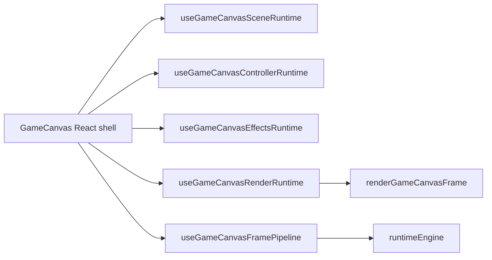
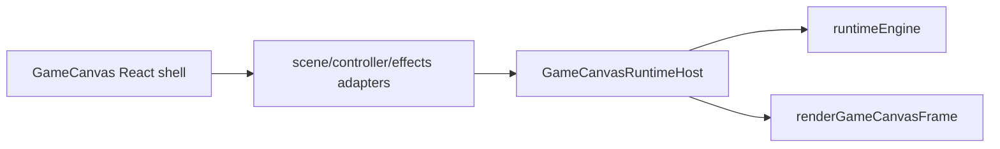

# GameCanvas Runtime Host Migration

## Goal

Move canvas runtime ownership out of React incrementally by introducing a per-canvas `GameCanvasRuntimeHost` class that React mounts/configures, while preserving playability and existing hooks during the transition.

## Current Boundary

React still owns canvas runtime composition in [client/src/components/GameCanvas.tsx](client/src/components/GameCanvas.tsx) by creating `sceneRuntime`, `controllerRuntime`, `effectsRuntime`, the renderer runtime, and the frame pipeline. The imperative engine pieces already exist in [client/src/engine/runtimeEngine.ts](client/src/engine/runtimeEngine.ts) and [client/src/engine/runtime/movementPredictionRuntime.ts](client/src/engine/runtime/movementPredictionRuntime.ts), but the canvas graph is still React-installed.

## Target First Increment

Add a per-canvas host class, likely in [client/src/engine/runtime/GameCanvasRuntimeHost.ts](client/src/engine/runtime/GameCanvasRuntimeHost.ts), that owns:

- the mutable render context/ref bundle now created in [client/src/engine/runtime/useGameCanvasRenderRuntime.ts](client/src/engine/runtime/useGameCanvasRenderRuntime.ts)
- a stable `renderFrame(renderAlpha)` method that calls [client/src/engine/frame/renderGameCanvasFrame.ts](client/src/engine/frame/renderGameCanvasFrame.ts)
- a `RuntimeFramePipeline` object compatible with [client/src/engine/runtimeEngine.ts](client/src/engine/runtimeEngine.ts)
- `mount()` / `unmount()` / `configure()` methods so React only installs and updates the host

React should still temporarily gather hook outputs, but instead of owning render/frame closures itself, it passes those outputs into the host.

## Implementation Steps

1. Create `GameCanvasRuntimeHost` as a per-canvas instance class in [client/src/engine/runtime/GameCanvasRuntimeHost.ts](client/src/engine/runtime/GameCanvasRuntimeHost.ts).
  Give it internal mutable state for render context, frame config, refs, and a `getFramePipeline()` method that returns `prepareFrame`, `processInputs`, `stepSimulation`, and `renderFrame` callbacks.
2. Extract the render-context shape from [client/src/engine/runtime/useGameCanvasRenderRuntime.ts](client/src/engine/runtime/useGameCanvasRenderRuntime.ts) into plain types owned by the host.
  Keep React-only hooks there for now, but make the hook update a host instance instead of owning `renderContextRef` itself.
3. Replace the inline frame-pipeline installation in [client/src/engine/runtime/useGameCanvasFramePipeline.ts](client/src/engine/runtime/useGameCanvasFramePipeline.ts) with host installation.
  `useGameCanvasFramePipeline()` should temporarily become a thin adapter that mounts the host into `runtimeEngine`, starts the engine loop, and unmounts on cleanup.
4. Update [client/src/components/GameCanvas.tsx](client/src/components/GameCanvas.tsx) to create/store one host instance per mounted canvas and pass hook-derived config into it.
  After this step, `GameCanvas` should no longer assemble render/frame ownership itself; it should mount/configure the host and render only the canvas plus overlay UI.
5. After render/frame ownership is stable, migrate scene next.
  Split [client/src/engine/runtime/useGameCanvasSceneRuntime.ts](client/src/engine/runtime/useGameCanvasSceneRuntime.ts) into a React data adapter and a pure scene snapshot assembler that the host can consume.
6. Migrate controller after scene.
  Start with [client/src/engine/runtime/useGameCanvasFrameRuntimeState.ts](client/src/engine/runtime/useGameCanvasFrameRuntimeState.ts), converting that mutable state bag into host-owned state, then move controller/build/interaction orchestration behind host inputs.
7. Migrate effects last.
  Keep [client/src/engine/runtime/useGameCanvasEffectsRuntime.ts](client/src/engine/runtime/useGameCanvasEffectsRuntime.ts) as a bridge initially, then split particle state production from hook-driven environmental/audio side effects and move the imperative ownership behind the host.

## Migration Constraints

- Do not attempt to move hook-bound logic unchanged into the class.
[client/src/engine/runtime/useGameCanvasSceneRuntime.ts](client/src/engine/runtime/useGameCanvasSceneRuntime.ts), [client/src/engine/runtime/useGameCanvasControllerRuntime.ts](client/src/engine/runtime/useGameCanvasControllerRuntime.ts), and [client/src/engine/runtime/useGameCanvasEffectsRuntime.ts](client/src/engine/runtime/useGameCanvasEffectsRuntime.ts) still depend on React hooks and should be treated as temporary adapters.
- Keep the existing singleton `runtimeEngine` contract for now.
The new host will be per-canvas, but the global engine loop can stay unchanged in this increment.
- Preserve current movement ownership.
[client/src/engine/runtime/movementPredictionRuntime.ts](client/src/engine/runtime/movementPredictionRuntime.ts) is already a real runtime subsystem and should remain so.

## Success Criteria

- `GameCanvas` no longer owns the render context object or inline frame-pipeline closures.
- A non-React `GameCanvasRuntimeHost` instance owns `renderFrame()` and the `RuntimeFramePipeline` methods.
- React only mounts/configures the host and passes hook-derived runtime inputs into it.
- Existing playability, movement prediction, overlay UI, and build/render behavior remain unchanged.

## End-State Direction

After the first increment, the architecture should look like this:

That gets render/frame ownership out of React first, then makes `scene -> controller -> effects` the next staged extractions toward a genuinely engine-owned canvas runtime.