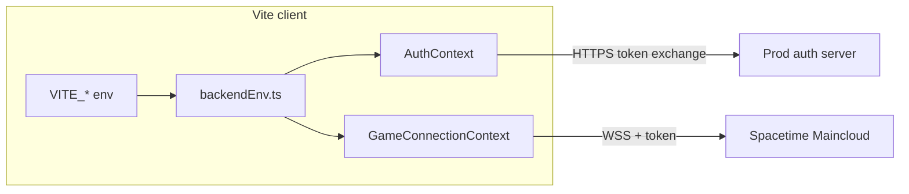

# Local UI with production backends (env flags)

## Problem

Today both [client/src/contexts/GameConnectionContext.tsx](client/src/contexts/GameConnectionContext.tsx) and [client/src/contexts/AuthContext.tsx](client/src/contexts/AuthContext.tsx) set `isDevelopment = import.meta.env.DEV || window.location.hostname === 'localhost'`, which forces **local** Spacetime (`ws://localhost:3000`, `broth-bullets-local`) and **local** auth (`http://localhost:4001`) whenever you open the app on localhost. There is no switch for “local assets / local Vite, prod backends.”

## Approach

Introduce a **single resolver module** used by both contexts so URLs stay in sync and future forks can override without editing TS.

### Production defaults (this repo)

When `VITE_USE_PRODUCTION_BACKENDS=true` (or when the app is not on localhost / not Vite `DEV`), use the same values already hardcoded today:


| Backend                     | Value                                                 |
| --------------------------- | ----------------------------------------------------- |
| **Auth (OpenAuth issuer)**  | `https://broth-and-bullets-production.up.railway.app` |
| **SpacetimeDB WebSocket**   | `wss://maincloud.spacetimedb.com`                     |
| **Maincloud database name** | `broth-bullets`                                       |


Local dev defaults stay: `http://localhost:4001`, `ws://localhost:3000`, `broth-bullets-local`.

### Environment variables (Vite: must be prefixed with `VITE_`)


| Variable                       | Purpose                                                                                                                       |
| ------------------------------ | ----------------------------------------------------------------------------------------------------------------------------- |
| `VITE_USE_PRODUCTION_BACKENDS` | Set to `true` to use production **defaults** for auth + Spacetime even when `import.meta.env.DEV` or hostname is `localhost`. |
| `VITE_AUTH_SERVER_URL`         | Optional **full override** for auth issuer base URL (default prod: `https://broth-and-bullets-production.up.railway.app`).    |
| `VITE_SPACETIME_WS_URL`        | Optional override for WebSocket URI (default prod: `wss://maincloud.spacetimedb.com`).                                        |
| `VITE_SPACETIME_DATABASE`      | Optional override for database name (default prod: `broth-bullets`).                                                          |


**Precedence (per channel):** explicit `VITE_`* URL/name wins; else if `VITE_USE_PRODUCTION_BACKENDS === 'true'` use the same production constants currently hardcoded in the two files; else fall back to today’s “dev” branch (`localhost:4001`, `ws://localhost:3000`, `broth-bullets-local`); when not on localhost and not `DEV`, keep current production behavior (unchanged).

**Parsing:** treat `VITE_USE_PRODUCTION_BACKENDS` as true only when the string equals `'true'` (case-sensitive is fine; document as lowercase `true`).

### New file

Add [client/src/config/backendEnv.ts](client/src/config/backendEnv.ts) (name can match existing `client/src/config/` style) exporting:

- `authServerUrl: string`
- `spacetimeWsUrl: string`
- `spacetimeDatabaseName: string`
- `useLocalSpacetimeSocket: boolean` — `true` when the chosen WS URL is the local dev socket (e.g. `ws://localhost:3000`), used only for **connection timeout** in `GameConnectionContext` (keep 5s for local, 8s for remote) instead of reusing the old `isDevelopment` flag for timeouts.

Wire [GameConnectionContext.tsx](client/src/contexts/GameConnectionContext.tsx) and [AuthContext.tsx](client/src/contexts/AuthContext.tsx) to import these values; remove duplicated `isDevelopment` + URL constants from those files; keep console logs but label clearly (e.g. “backends: production (VITE_USE_PRODUCTION_BACKENDS)” vs “local”).




### Auth server: CORS for default Vite

The client exchanges the code via `fetch` to `${AUTH_SERVER_URL}/token` ([AuthContext.tsx](client/src/contexts/AuthContext.tsx) ~216). The browser sends `Origin: http://localhost:<vite-port>`.

In [auth-server-openauth/index.ts](auth-server-openauth/index.ts), the CORS `origin` array currently includes `http://localhost:3008` and `http://localhost:3009` but **not** Vite’s default `http://localhost:5173` (nor `127.0.0.1:5173`). Add those origins so **after Railway deploys** this change, local dev + prod auth works.

**Maintainer note for the plan doc:** shipping this CORS change to production is required for the workflow; self-hosting only the client against prod auth will fail CORS until then.

### Documentation

Update [README.md](README.md) section **Client Configuration** (~379+): replace the snippet that shows hardcoded `GameConnectionContext` logic with the new env-based workflow, including a copy-paste `client/.env.local` example:

```bash
VITE_USE_PRODUCTION_BACKENDS=true
```

Optionally add `client/.env.example` with commented variables (helps clones; minimal).

Also fix the outdated line in **Authentication Setup** that says to edit `AUTH_SERVER_URL` in `AuthContext.tsx` for production (~351) — point to `VITE_`* / build-time env instead.

## Out of scope

- Changing SpacetimeDB or OpenAuth **server** JWT rules (issuer/audience must already match Maincloud for prod tokens).
- Guaranteeing OAuth redirect allowlists beyond what OpenAuth already accepts (your `/token` flow stores whatever `redirect_uri` was used at login; CORS is the main browser constraint observed here).

## Testing (manual)

1. Default: no env → `npm run dev` on localhost still uses local auth + local Spacetime.
2. With `client/.env.local` containing `VITE_USE_PRODUCTION_BACKENDS=true` → same dev server connects to Railway auth URL + `wss://maincloud.spacetimedb.com` + `broth-bullets`, login completes **after** prod CORS includes `localhost:5173`.
3. Optional: set `VITE_SPACETIME_WS_URL` / `VITE_AUTH_SERVER_URL` and confirm overrides win over the toggle.

