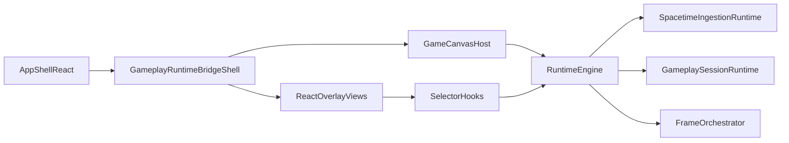

# Runtime-Owned Gameplay Engine Plan

## Target Boundary

React remains responsible for app bootstrap, providers, route/login/loading selection, the `<canvas>` host element, and DOM-only overlay rendering. The runtime engine owns gameplay execution: RAF, fixed-step simulation, viewport/subscription control, predicted movement, interaction scanning, frame assembly, render-pass orchestration, and canvas drawing.

## Current Seams To Exploit

- `[client/src/components/GameCanvas.tsx](client/src/components/GameCanvas.tsx)`: already declares the right end-state; the main remaining weight is top-level render orchestration and hot-path ref wiring.
- `[client/src/engine/frame/README.md](client/src/engine/frame/README.md)`: Stage 4 is still the correct next milestone, producing an engine-owned frame snapshot so `GameCanvas` becomes a thin host.
- `[client/src/hooks/useSpacetimeTables.ts](client/src/hooks/useSpacetimeTables.ts)`: already behaves like a lifecycle shim, but React still sits in the loop for viewport-driven subscription sync.
- `[client/src/components/GameplayRuntimeBridge.tsx](client/src/components/GameplayRuntimeBridge.tsx)`: still owns too much gameplay control-plane logic even though it is the right transitional boundary.
- `[client/src/engine/runtime/useGameplayScreenRuntime.ts](client/src/engine/runtime/useGameplayScreenRuntime.ts)`: good adapter boundary, but it still composes legacy React-hook session behavior.
- `[client/src/engine/runtimeEngine.ts](client/src/engine/runtimeEngine.ts)` and `[client/src/engine/types.ts](client/src/engine/types.ts)`: already provide the store and frame-pipeline surface needed for the end state.

## Migration Phases

### Phase 1: Make Frame Orchestration Runtime-Owned

Goal: `GameCanvas` stops sequencing draw passes directly.

- Introduce an engine-owned frame orchestrator under `[client/src/engine/frame/](client/src/engine/frame/)` that becomes the single owner of pass ordering and render invocation.
- Change the current `renderGame` contract so `[client/src/engine/runtime/useGameCanvasFramePipeline.ts](client/src/engine/runtime/useGameCanvasFramePipeline.ts)` calls a runtime/frame service, not a large callback assembled in React.
- Move remaining hot-path render dependency state from `[client/src/hooks/useGameCanvasRenderDependencyRefs.ts](client/src/hooks/useGameCanvasRenderDependencyRefs.ts)` into runtime/frame state objects owned outside React.
- Move render-adjacent lookup/derivation from `[client/src/hooks/useGameCanvasWorldLookups.ts](client/src/hooks/useGameCanvasWorldLookups.ts)` into frame-prep/runtime-derived state where possible.
- Shrink `[client/src/components/GameCanvas.tsx](client/src/components/GameCanvas.tsx)` to: canvas ref host, DOM event bridge, runtime start/stop hookup, and overlay composition.

### Phase 2: Move World Ingestion And Viewport Subscription Control Out Of React

Goal: React no longer mediates between runtime viewport state and subscription behavior.

- Replace the `App -> selector viewport -> useSpacetimeTables -> runtime` loop with a runtime-owned gameplay ingestion service.
- Re-scope `[client/src/hooks/useSpacetimeTables.ts](client/src/hooks/useSpacetimeTables.ts)` into either:
  1. a tiny mount/unmount bridge that installs the ingestion runtime, or
  2. complete removal if the connection bootstrap can register the ingestion service directly.
- Move viewport observation and chunk subscription decisions into runtime modules near `[client/src/engine/runtime/gameplaySubscriptionsRuntime.ts](client/src/engine/runtime/gameplaySubscriptionsRuntime.ts)`.
- Keep selectors as read-only consumers of runtime state; do not reintroduce table ownership to React hooks.

### Phase 3: Turn GameplayRuntimeBridge Into A Thin Host

Goal: the bridge mounts gameplay runtime services instead of owning them.

- Move movement prediction, interaction state, mobile input, and drag/drop session wiring behind a runtime gameplay host/service boundary extracted from `[client/src/components/GameplayRuntimeBridge.tsx](client/src/components/GameplayRuntimeBridge.tsx)`.
- Preserve React ownership only where DOM APIs require it, but store live gameplay state in the runtime engine instead of local hook stacks.
- Convert `[client/src/engine/runtime/useGameplaySessionRuntime.ts](client/src/engine/runtime/useGameplaySessionRuntime.ts)` and adjacent bridge hooks into a more explicit gameplay host boundary: install services, expose selector state, return minimal view props.
- Reduce prop volume flowing from `GameplayRuntimeBridge` into `[client/src/components/GameScreen.tsx](client/src/components/GameScreen.tsx)` by replacing imperative prop plumbing with selector/view-model reads where feasible.

### Phase 4: Make GameScreen And Overlays Pure Composition

Goal: screen/UI layers read selector-backed view models and stop coordinating gameplay behavior.

- Continue dissolving `[client/src/hooks/useGameScreenSessionUi.ts](client/src/hooks/useGameScreenSessionUi.ts)` by moving remaining orchestration into runtime/session services.
- Keep the recently split hooks such as `[client/src/hooks/useGameplayScreenProgressionRuntime.ts](client/src/hooks/useGameplayScreenProgressionRuntime.ts)`, `[client/src/hooks/useGameplayScreenUiActionRuntime.ts](client/src/hooks/useGameplayScreenUiActionRuntime.ts)`, and `[client/src/hooks/useGameplayScreenAudioRuntime.ts](client/src/hooks/useGameplayScreenAudioRuntime.ts)` only as temporary seams; either fold them into runtime session services or narrow them to pure selector/view-model adapters.
- Rework `[client/src/contexts/GameUIContext.tsx](client/src/contexts/GameUIContext.tsx)` into a thin facade over engine UI state, not an ownership boundary.
- Keep `[client/src/App.tsx](client/src/App.tsx)` at its documented end state: bootstrap, gating, routing, and handoff only.

## Concrete File Targets

- `[client/src/components/GameCanvas.tsx](client/src/components/GameCanvas.tsx)`
- `[client/src/engine/frame/useFrameAssembly.ts](client/src/engine/frame/useFrameAssembly.ts)`
- `[client/src/engine/frame/renderWorldPreparationPasses.ts](client/src/engine/frame/renderWorldPreparationPasses.ts)`
- `[client/src/engine/frame/renderEntityWorldPasses.ts](client/src/engine/frame/renderEntityWorldPasses.ts)`
- `[client/src/engine/frame/renderTranslatedWorldExtras.ts](client/src/engine/frame/renderTranslatedWorldExtras.ts)`
- `[client/src/engine/frame/renderScreenSpaceWorldEffects.ts](client/src/engine/frame/renderScreenSpaceWorldEffects.ts)`
- `[client/src/engine/frame/renderLateFramePasses.ts](client/src/engine/frame/renderLateFramePasses.ts)`
- `[client/src/engine/runtime/useGameCanvasFramePipeline.ts](client/src/engine/runtime/useGameCanvasFramePipeline.ts)`
- `[client/src/hooks/useSpacetimeTables.ts](client/src/hooks/useSpacetimeTables.ts)`
- `[client/src/engine/runtime/gameplaySubscriptionsRuntime.ts](client/src/engine/runtime/gameplaySubscriptionsRuntime.ts)`
- `[client/src/components/GameplayRuntimeBridge.tsx](client/src/components/GameplayRuntimeBridge.tsx)`
- `[client/src/engine/runtime/useGameplayScreenRuntime.ts](client/src/engine/runtime/useGameplayScreenRuntime.ts)`
- `[client/src/engine/runtime/useGameplaySessionRuntime.ts](client/src/engine/runtime/useGameplaySessionRuntime.ts)`
- `[client/src/components/GameScreen.tsx](client/src/components/GameScreen.tsx)`
- `[client/src/App.tsx](client/src/App.tsx)`

## Guardrails

- Do not rewrite everything into classes/services in one jump; preserve current hook boundaries as extraction seams and migrate one ownership boundary at a time.
- Prefer runtime-owned state for hot paths and coordination, selector hooks for reads, and React local state only for truly local DOM/view concerns.
- After each phase, `tsc -b` should still pass and gameplay should still function before starting the next extraction.
- Treat `GameCanvas` render orchestration as the first high-leverage milestone; it is the biggest remaining blocker to a true runtime-owned gameplay loop.

