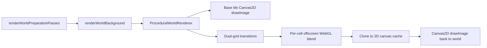

# Terrain Rendering Optimization Plan

## Brutally Honest Recommendation

I would not implement all four ideas at once.

The current bottleneck risk is not the 13-ish base tile images. It is the procedural transition path: each procedural dual-grid cell renders through WebGL into an offscreen canvas, clones that into a 2D canvas, caches it, then draws it back with Canvas2D. That GPU-to-2D intermediate path is the suspicious part.

Chunk caching and a full batched WebGL terrain pass may improve performance, but they are larger architectural changes. They should only happen after we measure that `worldTransitionsMs` or `worldBaseTilesMs` is actually significant in real play.

## Current Architecture To Leverage

Relevant files:

- [client/src/utils/renderers/proceduralWorldRenderer.ts](client/src/utils/renderers/proceduralWorldRenderer.ts): base tile pass, transition pass, per-tile cache, dual-grid rendering.
- [client/src/utils/renderers/dualGridProceduralBlendWebGL.ts](client/src/utils/renderers/dualGridProceduralBlendWebGL.ts): current offscreen WebGL procedural blend and CPU canvas cache.
- [client/src/utils/renderers/worldRenderingUtils.ts](client/src/utils/renderers/worldRenderingUtils.ts): world renderer singleton and timing aggregation.
- [client/src/engine/frame/renderWorldPreparationPasses.ts](client/src/engine/frame/renderWorldPreparationPasses.ts): main frame world pass and profiler integration.
- [client/src/hooks/useGameCanvasWorldLookups.ts](client/src/hooks/useGameCanvasWorldLookups.ts): visible tile map assembly from chunk data.

The important existing flow is:

## Proposed Stages

1. Add or use existing profiler evidence first.
   - Capture `worldBaseTilesMs`, `worldTransitionsMs`, `worldCacheUpdateMs`, and total `worldBackground` in a real beach/forest/water scene.
   - If transitions are not a meaningful slice, do not rewrite the terrain pipeline yet.

2. Optimize procedural transitions before touching base tiles.
   - Stop treating every procedural cell as a generated 2D canvas artifact.
   - Prototype a batched transition renderer that groups visible transition cells by texture pair and draws them through WebGL in fewer passes.
   - Keep base tile rendering image-based.

3. Preserve visual behavior while batching.
   - Carry per-cell data into the shader: world origin, corner weights, flip flags, and clip-corner mask.
   - Group by texture pair first instead of building a texture atlas immediately.
   - Leave CPU fallback intact for browsers without WebGL2.

4. Only consider chunk terrain caching after measuring base-tile cost.
   - Chunk size is 16 tiles, so chunk caching means rendering 512x512 pixel chunk surfaces at the current 32px tile size.
   - It may help if base tile drawing is expensive, but it adds invalidation complexity around tile updates and transition cells crossing chunk borders.
   - Do this only if `worldBaseTilesMs` is a real bottleneck.

## What I Would Not Do First

- I would not remove base tile images. There are only about 13 unique base textures, and texture sampling is not the likely bottleneck.
- I would not build a full terrain atlas immediately. Grouping by texture pair is simpler and lower risk.
- I would not implement chunk caching and batched WebGL in the same change. If visuals regress, debugging becomes much harder.
- I would not remove the CPU fallback until the WebGL path is proven stable.

## Expected Performance Impact

Likely helpful:

- Removing per-cell WebGL canvas clone/copy behavior.
- Reducing Canvas2D compositing calls for procedural transitions.
- Grouping transition cells by texture pair.

Uncertain until measured:

- Chunk-level terrain caching.
- Fully procedural base textures.
- Texture atlas or texture-array rewrite.

My recommended first implementation is a profiler-driven transition batching prototype, not a full terrain rewrite.